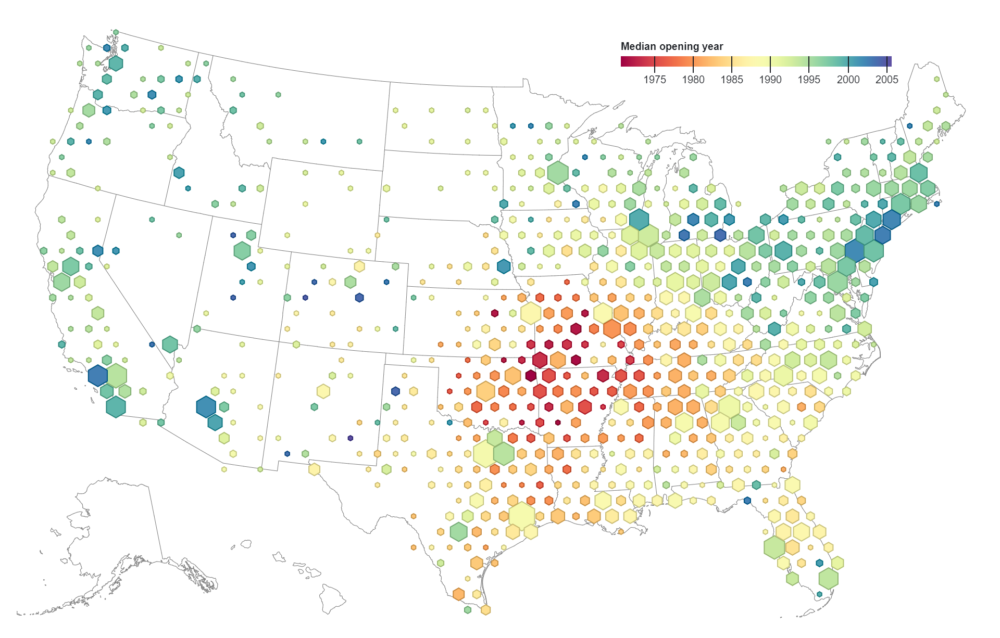

# Pokročilé metody tematické kartografie (část 1)
## Pravidelná polygonová síť (grid)
Metoda gridu (angl. binning, hexagon bin, hexbin) neboli pravidelné polygonové sítě, se řadí
ke zvláštnímu druhu areálových metod. Princip leží v zanedbání původních administrativních
hranic a rozdělení území pomocí pravidelné mřížky na buňky stejné velikosti, které nepodléhají
časově a územně proměnlivé administrativní struktuře. Použití pravidelné mřížky usnadňuje analýzu prostorových vzorců a pomáhá vizuálně interpretovat rozložení bodových dat, zejména v případě velkých datových souborů. Tato metoda umožňuje agregaci dat do pravidelné sítě buněk. Každá buňka pak obsahuje souhrnné statistiky bodových prvků, které do ní spadají – například jejich počet, průměrné hodnoty vybraných atributů nebo jiné metriky.

<figure markdown>
  { width=500px }
</figure>

## Waffle
Metoda *Waffles* zobrazuje kvantity kategorií tvořící celek. Je podobná pie chartu, ale má mřížkový vzhled. Každá ze složek kategorie je pak v mřížce zobrazena jako opakující se symbol. Symbolika se obvykle provádí pomocí různých odstínů, které reprezentují různé kategorie. Metodu lze rovněž využít pro zobrazení časových řad.

<figure markdown>
  "){ width=500px }
</figure>

[Waffle grid toolbox for ArcGIS](https://carto.maps.arcgis.com/home/item.html?id=d749baac3ede42c3b6f011dc41627b03){ .md-button .md-button--primary .server_name .external_link_icon_small target="_blank"}
[Mapping coronavirus waffles](https://www.esri.com/arcgis-blog/products/arcgis-pro/mapping/mapping-coronavirus-waffles/){ .md-button .md-button--primary .server_name .external_link_icon_small target="_blank"}
[Největší emitenti ČR](https://faktaoklimatu.cz/infografiky/nejvetsi-emitenti-cr){ .md-button .md-button--primary .server_name .external_link_icon_small target="_blank"}
[Tile grid waffle chart map in excel](https://policyviz.com/2017/09/20/tile-grid-waffle-chart-map-in-excel/){ .md-button .md-button--primary .server_name .external_link_icon_small target="_blank"}
{: .button_array}

