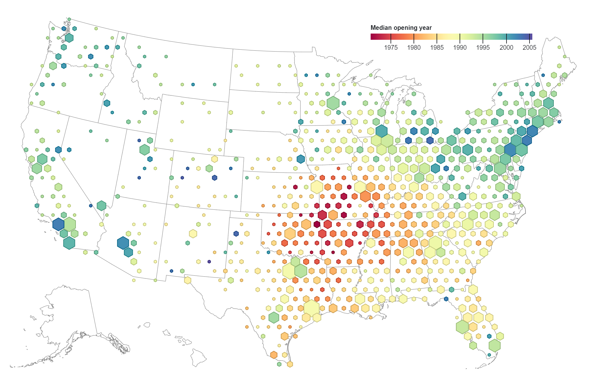

# Pokročilé metody tematické kartografie (část 2)

## Pravidelná polygonová síť (grid)
Metoda gridu (angl. binning, hexagon bin, hexbin) neboli pravidelné polygonové sítě, se řadí
ke zvláštnímu druhu areálových metod. Princip leží v zanedbání původních administrativních
hranic a rozdělení území pomocí pravidelné mřížky na buňky stejné velikosti, které nepodléhají
časově a územně proměnlivé administrativní struktuře. Použití pravidelné mřížky usnadňuje analýzu prostorových vzorců a pomáhá vizuálně interpretovat rozložení bodových dat, zejména v případě velkých datových souborů. Tato metoda umožňuje agregaci dat do pravidelné sítě buněk. Každá buňka pak obsahuje souhrnné statistiky bodových prvků, které do ní spadají – například jejich počet, průměrné hodnoty vybraných atributů nebo jiné metriky.

<figure markdown>
  { width=500px }
</figure>

## Coxcomb
Jedná se o varianta na pie chart, která vzniká dělením kruhu do rovnoměrných segmentů (např. dle počtu časových úseků), s poloměrem (výseče) lišícím se podle kvantity jevu. Výsledkem jsou segmenty, které se liší rozsahem od středu grafu. Obvykle se používá k zobrazení časových jevů v souladu s původním použitím Florence Nightingale v jejím klasickém diagramu úmrtnosti východních armád z roku 1858.

<figure markdown>
  "){ width=500px }
</figure>

[Coxcomb toolbox for ArcGIS](https://carto.maps.arcgis.com/home/item.html?id=ebdf8024e9714c7dbfa4f5342634fcdb){ .md-button .md-button--primary .server_name .external_link_icon_small target="_blank"}
[Mapping coronavirus coxcombs](https://www.esri.com/arcgis-blog/products/arcgis-pro/mapping/mapping-coronavirus-coxcombs/){ .md-button .md-button--primary .server_name .external_link_icon_small target="_blank"}
{: .button_array}

???+ tip "Legenda"
      V případě metody **coxcombs** toolbox sice vytvoří kartodiagramy, ale nadstavba pro tvorbu legendy v layoutu neexistuje. Proto
      je nutné si připravit data způsobem, který zajistí tvorbu legendy již v samotném průběhu vizualizace. Doporučení pro strukturu
      coxcombs tedy zní takto:

      - do tabulky dat přidejte fiktivní záznamy, které budou obsahovat globální minimum a globální maximum (stejné napříč všemi kategoriemi)

      - další (tedy třetí) fiktivní záznam bude obsahovat takové hodnoty, které se objeví v legendě (tzn. vhodně zaokrouhlené a rostoucí po směru hodin)
      
      - pokud záznamy pouze vkládáte jako *Add Row* v atributové tabulce, umístí se do počátku souřadnicového systému; vy však můžete přemístit bod
      reprezentující legendu (třetí fiktivní záznam) do blízkosti mapového obsahu, aby se zobrazil v mapovém okně layoutu.

[Data](../assets/data/Coxcomb_Mzdy_DRI.xlsx) k testování metody zahrnují vývoj mezd v Česku a za stejné období vývoj cen nemovitostí (ceny za metr čtvereční) pro jednotlivé kraje.