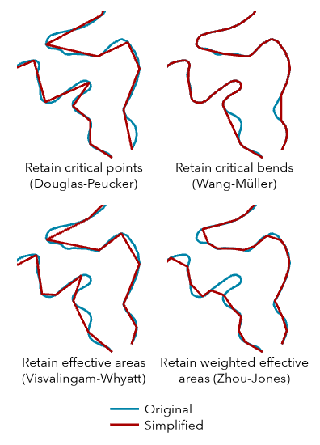
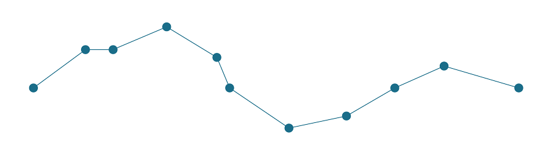

# Kartografická generalizace

Kartografická generalizace je klíčový proces při tvorbě map, který umožňuje přizpůsobit geografická data měřítku a účelu mapy.

### **Definice generalizace**

- **[map design]**:
    Abstrakce, redukce a zjednodušení prvků při změně měřítka nebo rozlišení.

- **[data editing – vektorová data]**:
    Proces redukce počtu bodů linie při zachování jejího základního tvaru.

- **[data editing – rastrová data]**:
    Proces zvětšování a převzorkování buněk rastru.

---

## How-to: Simplify Line / Polygon (ArcGIS Pro)

**Umístění:**  
`Geoprocessing Tools > Cartography toolbox > Generalization toolset`

**Popis:**  
Nástroj zjednodušuje linie nebo polygony odstraněním nadbytečných vertexů při zachování základního tvaru prvku.

**Parametry:**

- **algorithm** – použitý algoritmus generalizace  
- **tolerance** – míra zjednodušení (čím vyšší, tím větší redukce)  
- **minimum area** – minimální plocha (pro polygony)

<figure markdown>
  { width=500px }
</figure>

---

## Algoritmy zjednodušení linií

### **Douglas–Peucker**

Jeden z nejznámějších algoritmů pro zjednodušení linií.

**Princip:**

- Spojí první a poslední bod linie přímkou  
- Najde bod s největší vzdáleností od této přímky  
- Pokud je vzdálenost větší než tolerance → bod se zachová  
- Proces se rekurzivně opakuje  

**Vlastnosti:**

- rychlý  
- může vytvářet „ostřejší“ (hranatější) tvary  
- vhodný pro technické/umělé objekty  

<figure markdown>
  { width=500px }
</figure>
---

### **Visvalingam–Whyatt**

Alternativní algoritmus založený na ploše.

**Princip:**

- Pro každou trojici sousedních bodů vytvoří trojúhelník  
- Identifikuje trojúhelník s nejmenší plochou  
- Pokud je plocha menší než tolerance → bod se odstraní  
- Proces se opakuje  

**Vlastnosti:**

- produkuje „hladší“ a přirozenější geometrie  
- vhodný pro přírodní objekty (řeky, pobřeží)  
- pomalejší než Douglas–Peucker  

<figure markdown>
  { width=500px }
</figure>
---

### **Srovnání algoritmů**

| Vlastnost | Douglas–Peucker | Visvalingam–Whyatt |
|----------|----------------|-------------------|
| Kritérium | vzdálenost | plocha |
| Rychlost | vyšší | nižší |
| Výsledek | ostřejší | hladší |
| Vhodnost | technické prvky | přírodní prvky |

---

### **Klíčové pojmy**

- **Tolerance (ε)**  
  Určuje míru zjednodušení – čím vyšší hodnota, tím více bodů je odstraněno  

- **Zachování tvaru**  
  Cílem je minimalizovat ztrátu charakteristických rysů linie  

- **Topologie**  
  Některé algoritmy mohou narušit topologické vztahy (např. vznik překryvů) :contentReference[oaicite:4]{index=4}  

---

### **Interaktivní ukázka**

Vyzkoušejte si, jak funguje zjednodušení linií v praxi:

<iframe width="100%" height="750" src="https://bost.ocks.org/mike/simplify/" 
title="Line Simplification Interactive Demo">
</iframe>

---

### **Shrnutí**

- Generalizace je nezbytná pro práci s různými měřítky map  
- Zjednodušení linií je jednou z nejčastějších operací  
- Volba algoritmu ovlivňuje výsledný vzhled mapy  
- Neexistuje univerzálně nejlepší metoda – záleží na typu dat a účelu mapy  

---

# Základní principy tvorby mapového layoutu

Při sestavování mapy do layoutu je potřeba zohlednit mnoho aspektů. Níže jsou tři klíčové principy, které byste měli mít na paměti:

#### 1. Vyvážená kompozice  
Mapa i všechny ostatní prvky mají svou „vizuální váhu“. Kvalitní layout tyto prvky vyvažuje.

#### 2. Strukturovaný a redukovaný text  
Práce s textem vyžaduje disciplínu: zkracovat, zpřesňovat nebo úplně vypouštět to, co by jinak tvořilo dlouhé titulky a odstavce. Dobrý layout více ukazuje než vysvětluje.

#### 3. Zjednodušené doplňkové prvky  
Někdy je potřeba přistupovat k návrhu „střízlivě“ – zjednodušit nebo úplně odstranit nadbytečné nemapové prvky.

---

*Každopádně mějme na paměti, že neexistuje jediný správný způsob, jak vytvořit mapu. Pokud ale hledáte vodítko, následující doporučení vám mohou pomoci při tomto často náročném procesu.*

---

### **Vyvážení kompozice**

- Upřednostněte velikost mapy  
- Oblast zájmu by měla určovat orientaci layoutu  
- Dopřejte oblasti zájmu dostatek prostoru  
- Používejte doplňkové prvky jako prostředek vyvážení  
- Využívejte vodicí linky

---

### **Organizace a redukce textu**

- Titulek tvořte pouze z klíčových slov  
- Kontext doplňte pomocí podtitulu  
- Text zkracujte, zpřesňujte nebo přesouvejte jinam  
- Integrujte popisky do mapy (např. selektivním zvýrazněním klíčových informací)  
- Uvádějte důvěryhodné zdroje dat a autorství  

---

### **Zjednodušení doplňkových prvků**

- Odstraňte zbytečné rámečky, pozadí a ohraničení mapy  
- Zjednodušte legendu (nebo ji integrujte do text či grafu)  
- Zjednodušte přehledovou mapu (např. pouze polygon bez podkladové mapy)  
- Zjednodušte nebo odstraňte severku (ideálně menší než váš palec)  
- Zjednodušte měřítko (používejte celá čísla a logické intervaly)  
- Odstraňte fotografie (případně alespoň jejich pozadí)

---

<iframe width="560" height="315" src="https://www.youtube.com/embed/q93ZAFoS_bc" 
title="Layout Advice Bonanza – ArcGIS Pro" 
frameborder="0" 
allow="accelerometer; autoplay; clipboard-write; encrypted-media; gyroscope; picture-in-picture" 
allowfullscreen>
</iframe>