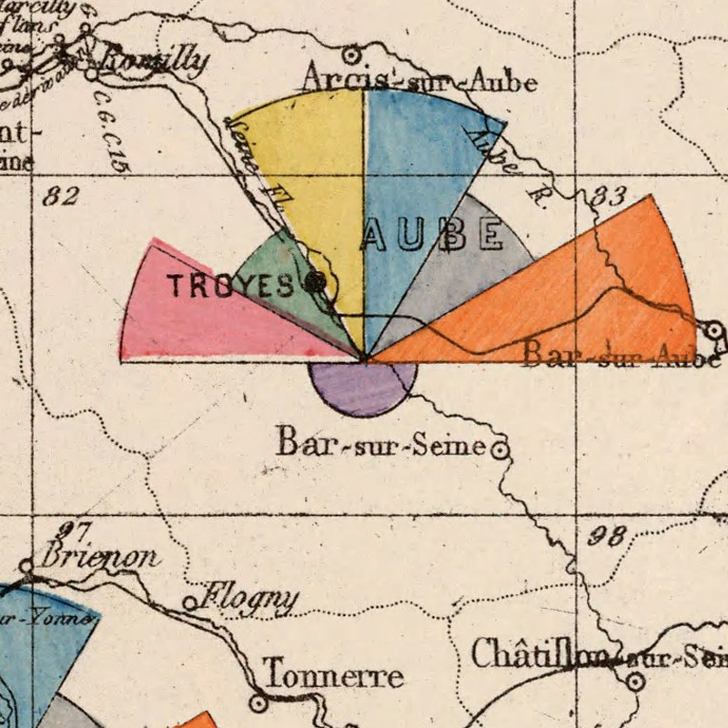
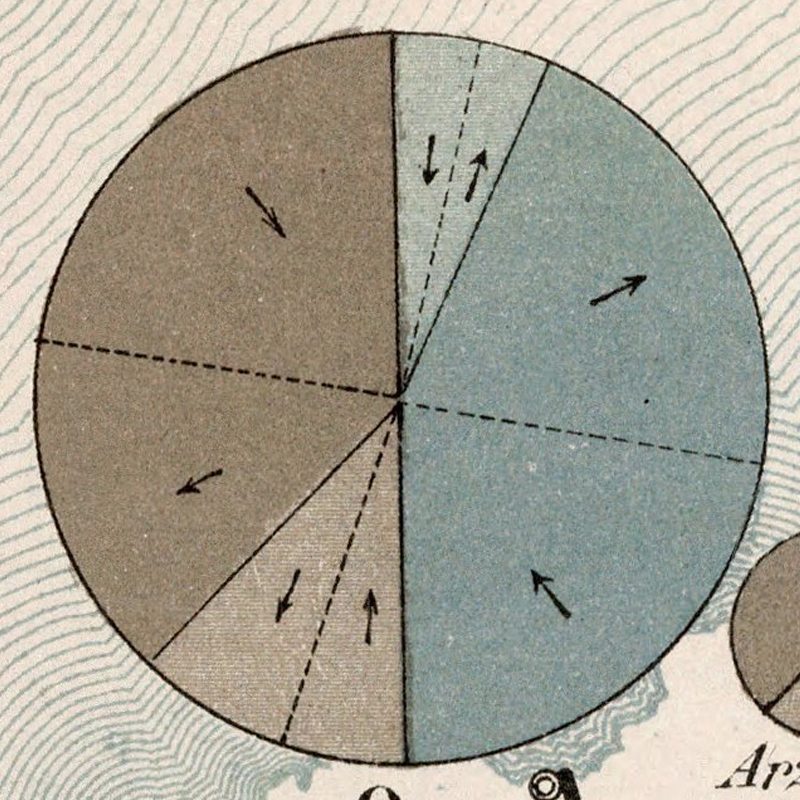
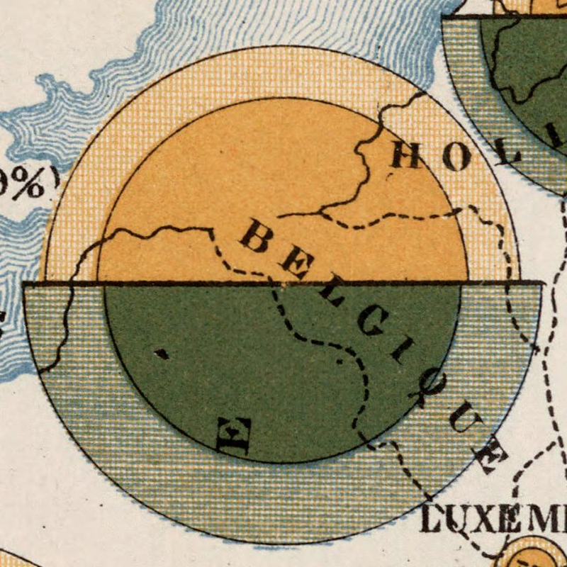
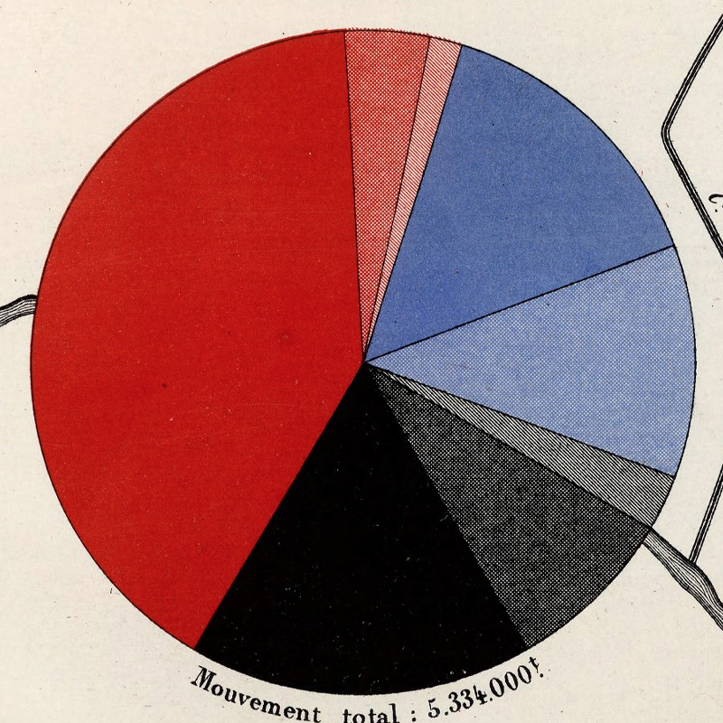
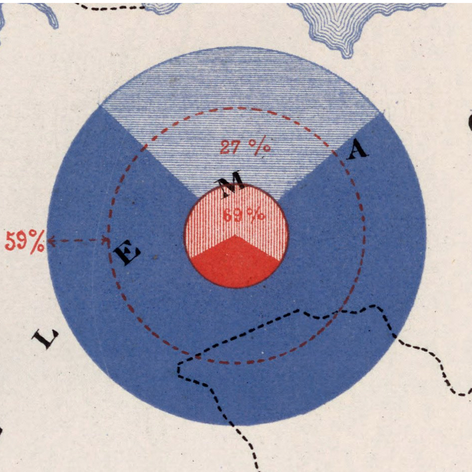
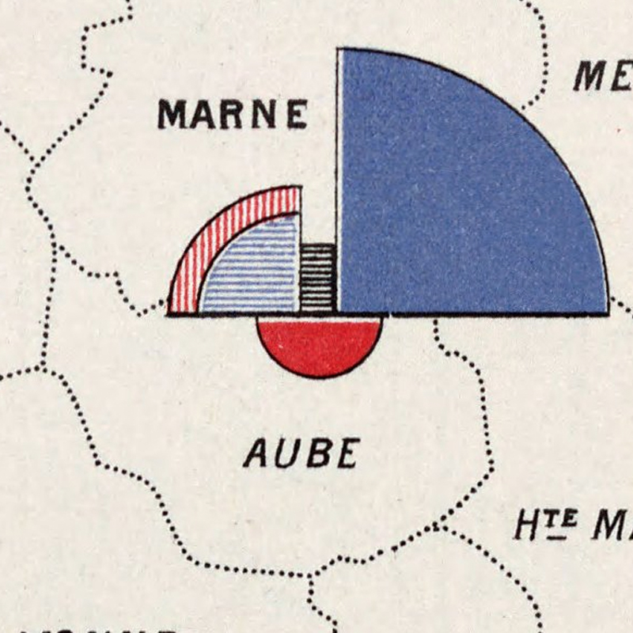
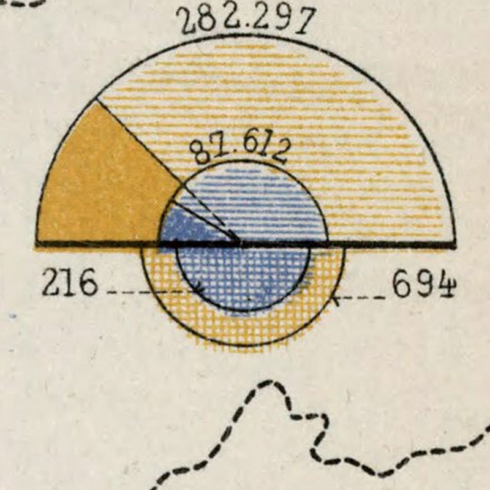
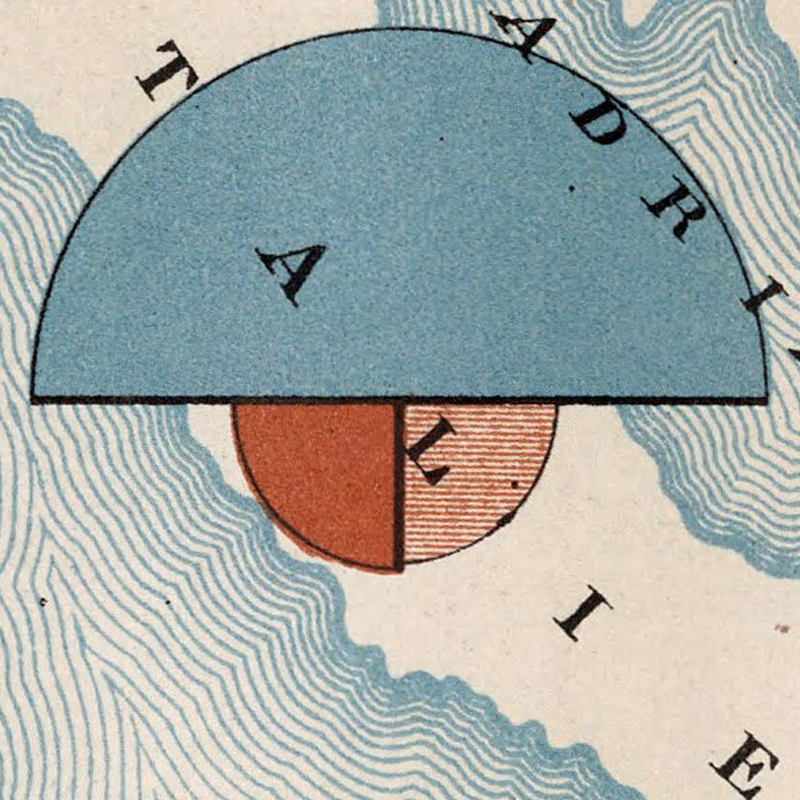
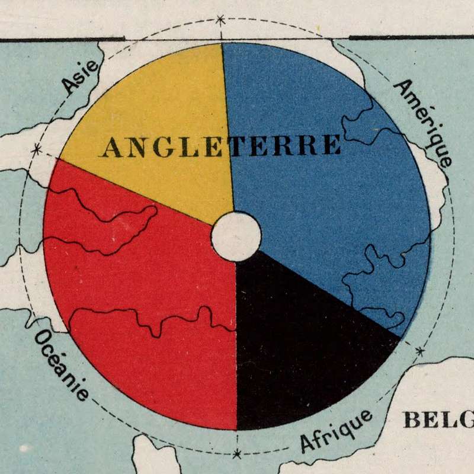

# Projekt – kartografie {: .page_title}

## Anotace
Cílem projektu je zkombinovat veškeré znalosti z předchozích předmětů Kartografie a GIS a samostatně vytvořit kartografické dílo. Jedná se o tvorbu mapy (mapového plakátu) o rozměru min. A2, kde mapová pole budou zabírat alespoň 2/3 plochy. Zbylé místo bude doplněno dalšími grafickými prvky (obrázky, grafy) a texty. Téma mapy je libovolné, každý student si na začátku zvolí téma své mapy, které bude konzultovat během prvních týdnů výuky. Po odsouhlasení tématu student sám zpracovává mapu, případně konzultuje problémy. Během první poloviny semestru jsou na cvičeních přednášena základní kartografická témata související s tvorbou map (obsahové a kompoziční prvky map, barvy, písmo, jazyk mapy, metody tematické kartografie, nejčastější kartografické chyby, grafické zpracování, DTP, tisk). Tři nejúspěšnější úlohy odměníme možností účasti na podzimní kartografické akci.

<figure markdown>

{: .process_container}
</figure>

<figure markdown>

{: .process_container}
</figure>

<figure markdown>

{: .process_container}
</figure>

## Kontroly

Před každým kontrolním dnem (odevzdání vždy do pondělní půlnoci) student vyplní následující formulář, který popisuje jeho práci.

<figure markdown>
{ width=200px }
</figure>

[pro.arcgis.com Kontrolní formulář](https://arcg.is/1XrH9a3){ .md-button .md-button--primary .server_name .external_link_icon_small target="_blank"}
{: .button_array}

### Binární kritéria

Aby byl výstup hodnocen, je bezpodmínečně nutné splnit následující povinné atributy:

-   min. 3 jevy v hlavní mapě;
-   min. 1 vedlejší mapa (stejné nebo jiné území; může být i detail hlavní mapy);
-   min. 1 graf nebo diagram.

### Kritéria pro hodnocení projektu

-   (25 %) správná aplikace metod tématické kartografie (splnění nároků na typ dat pro danou metodu, správná klasifikace dat a funkční závislosti, použití stupnic a asociativnosti barev, legenda);
-   (25 %) splnění obecných zásad kartografie (zobrazení, kompoziční prvky, generalizace dat, topografický podklad tematických map, popisy, čeština, typografie a úprava);
-   (10 %) infografika (správnost provedení, estetika);
-   (10 %) obtížnost, samostatnost;
-   (10 %) estetická stránka, design;
-   (10 %) oponentura;
-   (10 %) prezentace.